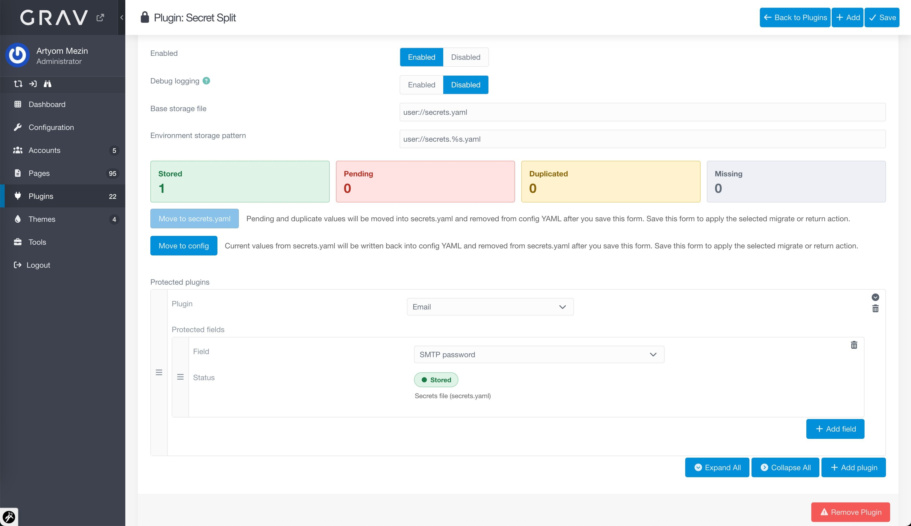

English | [Русский](README_RU.md)

# Secret Split Plugin

Store selected plugin secrets outside normal Grav config YAML while keeping regular plugin settings in their usual files.



## What It Does

- Loads secrets from private storage files:
  - base storage defaults to `user/secrets.yaml`
  - environment storage defaults to `user/secrets.<environment>.yaml`
- Overlays those values into Grav runtime config.
- Intercepts Admin saves for protected fields.
- Saves protected fields into private secret files instead of normal plugin config YAML.
- Removes protected keys from plugin config after save.

## Why

This is useful when you want to keep:

- normal plugin settings in git
- real secrets outside git

Typical examples:

- OAuth client secrets
- SMTP passwords
- Algolia API keys

## Why not `.env`, `setup.php`, or server variables?

Grav already supports configuration overrides through `setup.php` and server-side environment variables:

- https://learn.getgrav.org/17/advanced/multisite-setup#server-based-configuration-overrides

There are also plugins built around the environment-variable approach (.env files), for example:

- https://github.com/getgrav/grav-plugin-dotenv

These are valid approaches, but they also have tradeoffs:

- on shared hosting, server-level environment management may be unavailable or inconvenient
- `.env`, `setup.php`, and server overrides do not integrate with normal Admin and Flex save flows

`Secret Split` fills that niche: selected plugin secrets are moved out of tracked plugin config YAML into private storage files, while normal Admin editing and save continue to work.

## Requirements

- Grav 1.7.x or 2.x
- PHP 8.1+
- On Grav 2, the Admin Next UI also requires the `api` plugin — the custom field types and the state/migrate/return endpoints are served through it. The storage core works regardless.
- The plugin runs the same storage, save-interception, and migration logic on both generations; only the admin UI differs (see below)

## Installation

### GPM

```bash
bin/gpm install secret-split
```

### Manual

1. Download the ZIP archive of this repository.
2. Unpack it into `user/plugins/`.
3. Ensure the final plugin directory is:

```text
user/plugins/secret-split
```

## Storage Model

Base private storage default:

```yaml
user/secrets.yaml
```

Environment override default:

```yaml
user/secrets.<environment>.yaml
```

Examples:

- `user/secrets.yaml`
- `user/secrets.localhost.yaml`
- `user/secrets.example.com.yaml`

Both paths are configurable via Secret Split plugin settings:

- `base_storage_file`
- `environment_storage_pattern`

Behavior is intentionally close to Grav config layering:

- values coming from base plugin config are written to base `user/secrets.yaml`
- values coming from current env plugin config are written to `user/secrets.<environment>.yaml`
- returning values back to config restores them into the matching base or current env config layer
- secret files are created again automatically when the corresponding base or current env layer writes back into secrets
- if Grav environment name is empty / undefined, env-specific storage is disabled instead of creating `secrets.unknown.yaml`

Secret Split's own plugin configuration lives in:

```yaml
user/config/plugins/secret-split.yaml
```

That file stores the protected field list and plugin options.
Actual protected values live in the configured private storage files, which by default are `user/secrets.yaml` and `user/secrets.<environment>.yaml`.

## Admin UI

The plugin configuration lets you define protected fields grouped by plugin:

- choose a plugin
- choose one or more fields from that plugin
- `secret-split` itself is intentionally excluded from that list, so the plugin cannot protect its own control fields

Field labels are collected from plugin blueprints and shown using their admin-facing names.
As soon as a field is selected, the Admin UI also shows its current status and where the value is currently stored.

On Grav 2 (Admin Next) the same marking lives inside the plugin's own settings form: the `protected_fields` list uses the custom `secret-split-field` type (field select filtered by the row's plugin plus a live status chip), and the `secret-split-overview` field renders the status tiles and the **Move to secrets** / **Move to config** actions in the same place admin1 injected them. An optional **Sidebar menu entry** option (`admin_sidebar_item`, enabled by default) puts a Secret Split shortcut in the left admin sidebar that links straight to this settings page; disable it to keep only Plugins → Secret Split.

When the operator picks an environment in the Admin Next header switcher, Secret Split scopes statuses, saves, and file writes to that environment (base/env `secrets` files and the matching `env/<name>/config/plugins/*.yaml`) — mirroring the Grav 1.7 per-hostname layering.

## Password-like Fields

Password-like fields use Grav's field semantics automatically. Empty values for those fields mean:

- empty value means "keep existing secret"
- non-empty value means "replace secret"

This is needed for fields like:

- `plugins.email.mailer.smtp.password`

because password inputs in Grav Admin render empty by design.

For ordinary non-password protected fields, submitting an explicit empty value removes the stored secret automatically.

## Removing Protected Fields

Removing a field from `protected_fields` now removes both:

- the field entry from `secret-split` config
- the stored secret value from `secrets.yaml` / `secrets.<env>.yaml`

## Admin Overview Actions

The Admin overview supports two deferred actions:

- `Move to <secrets file>` prepares migration into private storage
- `Move to config` prepares returning stored values back into tracked plugin config YAML

After clicking either action, the Admin page immediately updates the visible field statuses and source labels to preview the future result.

On Grav 1.7 (admin classic) the real file changes still happen only after the normal Admin `Save`. On Grav 2 (Admin Next) the overview actions apply immediately — the SPA has no deferred form-save to attach them to.

After `Move to config` followed by `Save` (Grav 1.7) or the `Return to config` action (Grav 2):

- current values from the selected secrets file are written back into plugin config YAML
- the corresponding entries are removed from `user/secrets.yaml` / `user/secrets.<env>.yaml`
- field status changes from `Stored` to `Pending`
- the source label switches to the config YAML file

## Current Scope

Fully supported:

- normal plugin config save flow
- Flex configure flow, including `algolia-pro`

The Admin page uses live preview for field state, but real file changes are still applied only after the normal Admin `Save` (Grav 1.7; on Grav 2 the overview actions apply immediately).

## Operational Notes

- `debug_logging` enables verbose plugin-side logging for save, migrate, and Flex flows
- environment-specific storage is used only when Grav resolves a non-empty environment name
- secrets files are written with `0600` permissions; multi-file operations are serialized through `user/.secret-split.lock`

## Developer Notes

Internal Grav/Admin/Flex integration details, workarounds, and current limits are documented here:

- [docs/admin-integration-notes.md](docs/admin-integration-notes.md)

## License

MIT (see `LICENSE`).
